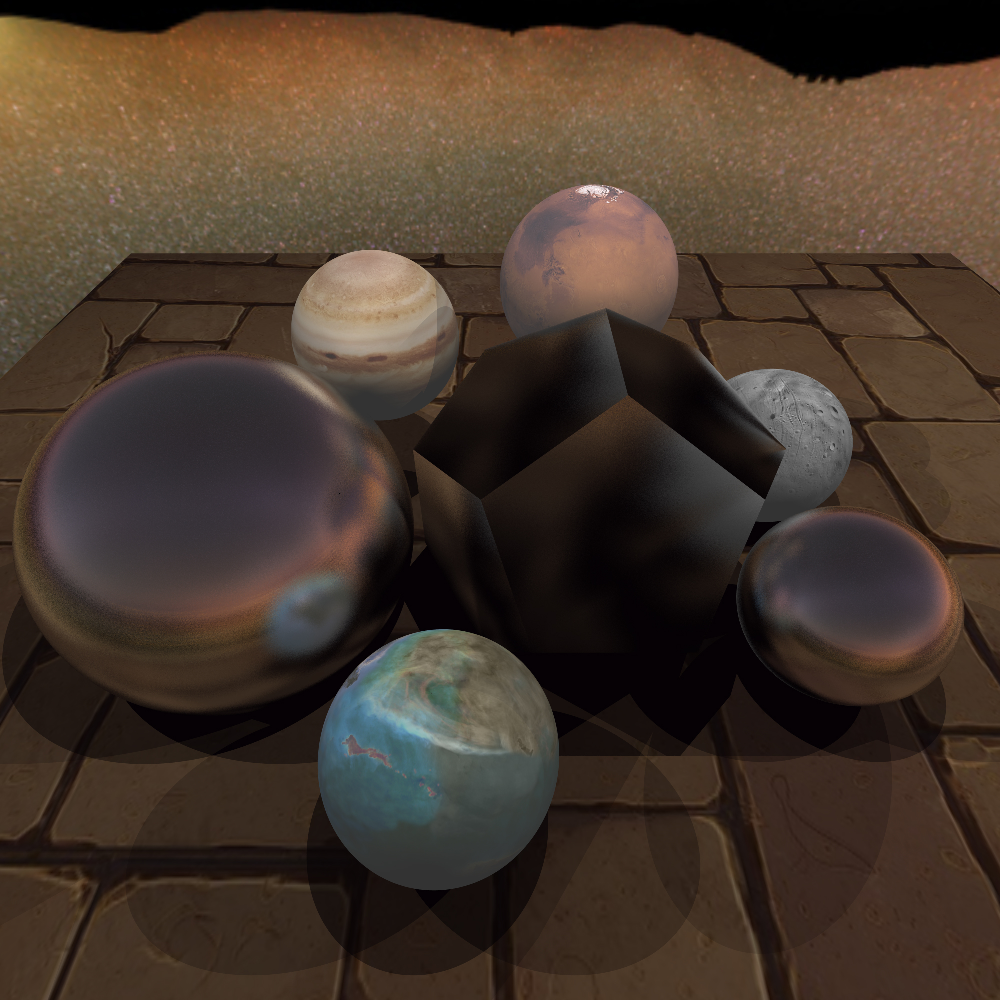

# Ray-Tracing-From-The-Ground-Up

This is an Ad-Hoc code for ray tracing   
TBD : Refractoring    

<a href=WebPages/csce647/pr01/readme.md> Project 01: 2D Raster Conversion </a> 
<a href=WebPages/csce647/pr02/readme.md> Project 02: Basic Camera Operation </a> 
<a href=WebPages/csce647/pr03/readme.md> Project 03: Basic Shading </a> 
<a href=WebPages/csce647/pr04/readme.md> Project 04: Shadow Casting </a> 
<a href=WebPages/csce647/pr05/readme.md> Project 05: Texture mapping </a> 
<a href=WebPages/csce647/pr06/readme.md> Project 06: Solid Textures </a> 
<a href=WebPages/csce647/pr07/readme.md> Project 07: Casting Triangles </a> 
<a href=WebPages/csce647/pr08/readme.md> Project 08: Specular Reflection </a> 
<a href=WebPages/csce647/pr09/readme.md> Project 09: Refraction </a> 
<a href=WebPages/csce647/pr10/readme.md> Project 10: Distributed Ray Tracing </a> 