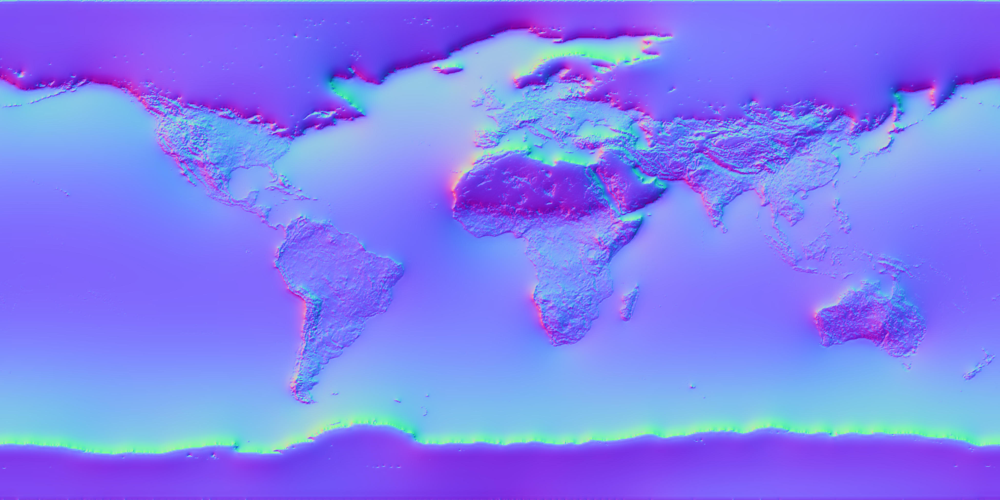
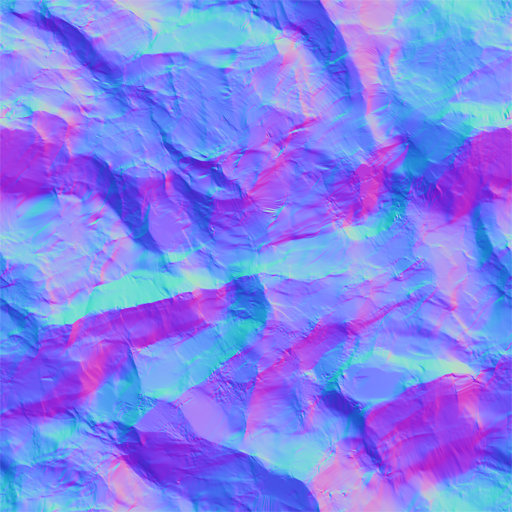

<table border=0 cellspacing=5 cellpadding=5 width=90%>

<tr>
<td align=center>
<b>Project 09: Refraction  
<b>Tushar T. 
</td>
</tr> 

<tr>
<td align=center>

<a href="exe.zip" download>
	[ Click here to download the executables for all tasks ]  
</a>
</tr>

<tr>
<td align=center>

 
Transparent impilict shape IOR = 1.5  
</td>
</tr> 

<tr>
<td align=center>

 
Transparent cube imported from OBJ file IOR = 1.5  
</td>
</tr>

<tr>
<td align=center>

<video width="600" controls>
  <source src="varying ior.mp4" type="video/mp4">
Your browser does not support the video tag
</video> 
Refraction of a sphere with IOR between [1.0, 2.5]  
</td>
</tr> 

<tr>
<td align=center>

  
 
Transparency using a striped texture; the black region sets IOR = 1.5, white region sets IOR = 2.5  
</td>
</tr>

<tr>
<td align=center>

  
 
Transparency using a normal map IOR = 2.0  
</td>
</tr>

<tr>
<td align=center>

<video width="600" controls>
  <source src="normal ior.mp4" type="video/mp4">
Your browser does not support the video tag
</video>  
 
Refraction of a plane using normal mapping and IOR between [1.0, 2.5]  
</td>
</tr> 

</table>

